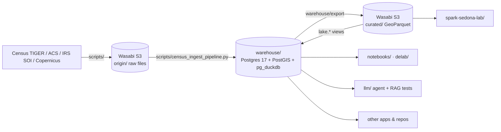

# GeoDataAnalytics

The data side of geospatial analytics. This repo covers acquiring US Census,
IRS and Copernicus data, landing it in object storage, modeling it in
PostGIS, analyzing it, and testing geospatial LLM agents against it.

It's the public "behind the scenes" for the data that powers
[GeoAgent](https://geoagent.app). App, user and infrastructure code lives
elsewhere. Nothing here depends on it.

## Segments

| Folder | What it is | Start here |
|---|---|---|
| [`warehouse/`](warehouse/) | **The central database.** PG17 + PostGIS + h3 + pg_duckdb on Hetzner (`:5434`). Hot tables are native; the full history is GeoParquet in Wasabi, queried in place. Owns the schema (`init-db/`), migrations and the S3 exporter. | `warehouse/README.md` |
| [`scripts/`](scripts/) | Acquisition and ETL CLIs: TIGER/Census survey/IRS downloaders, Copernicus CDS/CDSE fetchers, boundary loader, streaming EAV ingest (`census_ingest_pipeline.py`), survey-documentation analysis. | `scripts/COPERNICUS_README.md`, `--help` on each CLI |
| [`utils/`](utils/) | Small shared helpers (FIPS codes, geometry, zip extraction) used by `scripts/` and `notebooks/`. | n/a |
| [`notebooks/`](notebooks/) | Exploratory H3 work: census and world borders mapped to hex grids. | `Relate Borders to H3.ipynb` |
| [`delab/`](delab/) | Data engineering lab. Docker Compose stacks for JupyterLab (Hetzner-sized), a lab copy of the warehouse, and an nginx/certbot proxy. | `delab/README.md` |
| [`spark-sedona-lab/`](spark-sedona-lab/) | Single-node Apache Spark + Sedona: spatial joins, GeoParquet partitioning, a Wherobots Airflow DAG. Applying the same skills on a different engine. | `spark-sedona-lab/README.md` |
| [`llm/`](llm/) | Test harness for geospatial agentic AI and RAG over the census data: SQL validation suites (flood, weather, heat, air quality, ACS/IRS, GEOID, MVT) and a Python runner. *Early scaffolding; see the split plan.* | `llm/README.md` |
| [`transfer/`](transfer/) | One-off DB-to-DB copier for the `borders` / `hexes` / `hexes_borders` hex tables. | `transfer/README.md` |
| `reports/` | Written findings and charts generated by the analysis scripts. Local only (gitignored) until a report is finalized. | n/a |
| [`edu/`](edu/) | Penn State GEOG 489 coursework and a QGIS plugin skeleton. The academic origin of this repo. | `edu/PSU_GEOG_489/README.md` |
| `data/` | Local scratch only. Raw data lives in Wasabi under `origin/` (mounted read-only at `data/<bucket>/` via rclone when needed). | n/a |

## Where the data lives

| Location | Contents | Size |
|---|---|---|
| `s3://<bucket>/origin/` | Raw downloads: Census TIGER and surveys (ACS, decennial, PopEst, BRDS, economic census, gov finances, MHS), IRS SOI (county, ZIP, migration, congressional), Natural Earth | ~300 GiB, 210k files |
| `s3://<bucket>/curated/` | GeoParquet exports of `geographic_boundaries` and `geographic_data`, partitioned by `boundary_type/year`, with H3 + bbox keys | see `warehouse/README.md` |
| `warehouse` Postgres | Native PostGIS tables for the hot set, plus `lake.*` views over `curated/` | |

## Using the data from another repo or notebook

- **Through Postgres** (joins, PostGIS, one connection): connect to the
  warehouse as `geo_reader` and use `public.*` and `lake.*`.
- **Straight from S3** (no server): `read_parquet('s3://<bucket>/curated/...')`
  from DuckDB, GeoPandas (`gpd.read_parquet`), Sedona or QGIS with a read-only
  Wasabi key.

## Repo direction

See [`docs/REPO_SPLIT_PLAN.md`](docs/REPO_SPLIT_PLAN.md) for what stays, what
moves out, and the order of operations.

## License

MIT, see [LICENSE](LICENSE).
